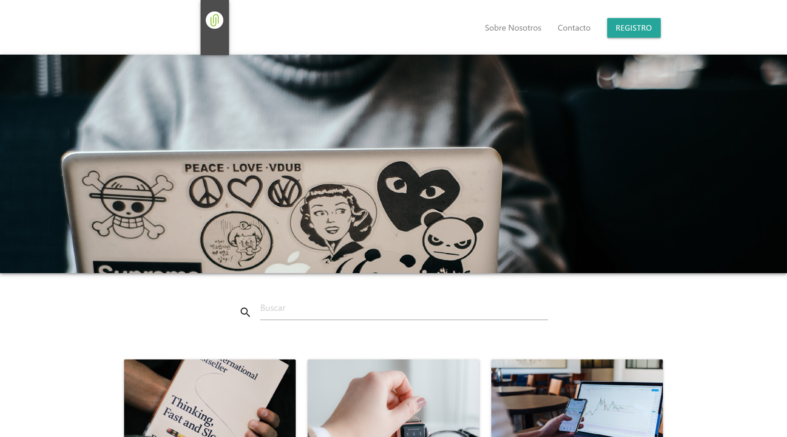

# Games4Gamers

¡Bienvenido y gracias por visitarme! Este es un proyecto elaborado como proyecto de aprendizaje en el uso del framework CSS Materialize en [Platzi](https://platzi.com/cursos/materialize/) en donde aplico varios de los conocimientos y habilidades adquiridas, entre ellas:

- Entender cómo funciona un framework de CSS
- Implementar Materialize en proyectos de desarrollo web
- Crear interfaces atractivas y funcionales basadas en Material Design
- Identificar cómo personalizar Materialize para tu webapp

## Preprocesadores usados

- Pug
- Sass

## Framework CSS usado

- Materialize

## Herramientas utilizadas

- Prepros

## Vista de Home

[Ver Home](https://diegoalesco95.github.io/Games4Gamers/G4G-principal.html)

## Licencia

[MIT License](LICENSE)
